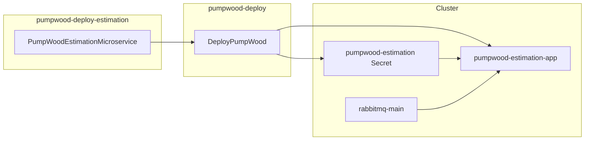

# pumpwood-deploy-estimation

Satellite deploy package for the **Pumpwood Estimation** microservice on
Kubernetes. It generates manifests for the API application and estimation
secrets — then hands them to
[`pumpwood-deploy`](https://github.com/Murabei-OpenSource-Codes/pumpwood-deploy)
for apply.

Developed by [Murabei Data Science](https://murabei.com). BSD-3-Clause.

<p align="center" width="60%">
   <br>

  <a href="https://en.wikipedia.org/wiki/Cecropia">
    Pumpwood is a native Brazilian tree
  </a> with a symbiotic relation to ants (Murabei)
</p>

---

## What it deploys

| Manifest | Kubernetes resources |
|----------|----------------------|
| `pumpwood_estimation__secrets` | Secret `pumpwood-estimation` |
| `pumpwood_estimation__deploy` | Deployment + Service `pumpwood-estimation-app` |

Estimation defines **model parameters** and the attributes used as
inputs and outputs of mathematical models. The app serves HTTP APIs.



---

## Prerequisites

This package does **not** stand alone. Before estimation pods can
start, the cluster must already provide:

| Resource | Provided by |
|----------|-------------|
| `storage` ConfigMap | `StandardMicroservices` in `pumpwood-deploy` |
| `general-secrets` | `StandardMicroservices` |
| `rabbitmq-main-secrets` | `StandardMicroservices` |
| Storage keys (GCP / Azure / AWS) | `DeployPumpWood` storage config |
| Postgres for estimation | `PostgresDatabase` + `PGBouncerDatabase` |
| Auth (typical) | [`pumpwood-deploy-auth`](https://github.com/Murabei-OpenSource-Codes/pumpwood-deploy-auth) |

Storage bucket name and type are read from the cluster `storage`
ConfigMap — they are **not** passed to
`PumpWoodEstimationMicroservice`.

The application reads `DB_PASSWORD` and `MICROSERVICE_PASSWORD` from
the **`pumpwood-estimation`** secret created by this package.

---

## Installation

```bash
pip install pumpwood-deploy-estimation
```

Requires `pumpwood-deploy`.

---

## Quick start

```python
import os
import simplejson as json
from dotenv import load_dotenv
from pumpwood_deploy.deploy import DeployPumpWood
from pumpwood_deploy.microservices.postgres.deploy import (
    PostgresDatabase, PGBouncerDatabase)
from pumpwood_deploy_estimation import PumpWoodEstimationMicroservice

with open("secrets/production.json", "r") as file:
    secrets = json.loads(file.read())
load_dotenv()

deploy = DeployPumpWood(
    model_user_password=secrets["microservices--model"],
    rabbitmq_secret=secrets["rabbitmq_secret"],
    hash_salt=secrets["hash_salt"],
    storage_type="aws_s3",
    storage_deploy_args={
        "storage_bucket_name": "my-pumpwood-bucket",
        "access_key_id": secrets["aws_access_key_id"],
        "secret_access_key": secrets["aws_secret_access_key"],
    },
    k8_provider="aws",
    k8_deploy_args={
        "region": "us-east-1",
        "cluster_name": "my-cluster",
    },
    k8_namespace="pumpwood",
)

deploy.add_microservice(
    PostgresDatabase(
        db_username="pumpwood",
        db_password=secrets["postgres_password"],
        name="postgres-main",
        disk_name="postgres-disk",
        disk_size="150Gi",
    ))

deploy.add_microservice(
    PGBouncerDatabase(
        name="pgbouncer-pumpwood-estimation",
        postgres_database="pumpwood_estimation",
        postgres_secret="postgres-main",
        postgres_host="postgres-main",
    ))

deploy.add_microservice(
    PumpWoodEstimationMicroservice(
        app_version=os.getenv("PUMPWOOD_ESTIMATION_APP"),
        repository="my-registry.example.com",
        db_host="pgbouncer-pumpwood-estimation",
        db_database="pumpwood_estimation",
        db_password=secrets["postgres_password"],
        microservice_password=secrets["microservice--estimation"],
        app_replicas=1,
        app_debug="FALSE",
    ))

deploy.create_deploy_files()
deploy.deploy_microservices()
```

### Environment variables

```bash
PUMPWOOD_ESTIMATION_APP=2.1.0
```

If the rendered manifest matches what is already on the cluster, `kubectl
apply` produces no changes — safe for rolling image updates.

---

## Configuration reference

### Required

| Parameter | Description |
|-----------|-------------|
| `app_version` | Image tag for `pumpwood-estimation-app` |

### Application database

Connection metadata for the app. Passwords are stored in the
estimation secret and mounted at runtime.

| Parameter | Default | Description |
|-----------|---------|-------------|
| `db_host` | `pgbouncer-pumpwood-estimation` | Postgres host |
| `db_port` | `5432` | Postgres port |
| `db_database` | `pumpwood` | Database name |
| `db_username` | `pumpwood` | Database user |
| `db_password` | `pumpwood` | Stored in estimation secret |
| `microservice_password` | `microservice--estimation` | Estimation service user |
| `repository` | GCR default | Docker registry for the app |

### Application

| Parameter | Default | Description |
|-----------|---------|-------------|
| `app_replicas` | `1` | Number of app pods |
| `app_debug` | `FALSE` | Debug flag |
| `app_workers` | `10` | Granian workers (`GRANIAN_WORKERS`) |
| `app_timeout` | `300` | Request timeout (seconds) |
| `app_limits_memory` | `60Gi` | Memory limit |
| `app_limits_cpu` | `12000m` | CPU limit |
| `app_requests_memory` | `20Mi` | Memory request |
| `app_requests_cpu` | `1m` | CPU request |

---

## Health check

The app Deployment exposes a readiness probe at:

```
GET /health-check/pumpwood-estimation-app/  (port 5000)
```

Use this path for ingress and load balancer health checks.

---

## Migration note

Older deploy scripts imported from the monolithic package:

```python
# Before
from pumpwood_deploy.microservices.pumpwood_estimation.deploy import (
    PumpWoodEstimationMicroservice)

# After
from pumpwood_deploy_estimation import PumpWoodEstimationMicroservice
```

Removed from the satellite API (use cluster-level config instead):

- `bucket_name` — now from `storage` ConfigMap
- `test_db_*` — use `PostgresDatabase` / `PGBouncerDatabase` from core
- `worker_version`, `datalake_db_*`, `worker_*` — raw-data worker deploy
  removed from this package

---

## Related packages

| Package | Role |
|---------|------|
| [`pumpwood-deploy`](https://github.com/Murabei-OpenSource-Codes/pumpwood-deploy) | Orchestrator, Kong, RabbitMQ, Postgres |
| [`pumpwood-deploy-datalake`](https://github.com/Murabei-OpenSource-Codes/pumpwood-deploy-datalake) | Datalake microservice |
| [`pumpwood-deploy-auth`](https://github.com/Murabei-OpenSource-Codes/pumpwood-deploy-auth) | Authorization microservice |

Full platform documentation:
[Murabei Open Source — pumpwood-deploy](https://murabei-opensource-codes.github.io/pumpwood-deploy/).

---

## Development

```bash
pip install -e ../pumpwood-deploy
pip install -e .

PYTHONPATH="src:../pumpwood-deploy/src" \
  python3 -m unittest discover \
  -s src/pumpwood_deploy_estimation/tests -p "test_*.py" -v

ruff check src/
```

---

## License

BSD-3-Clause — see [LICENSE](LICENSE).
